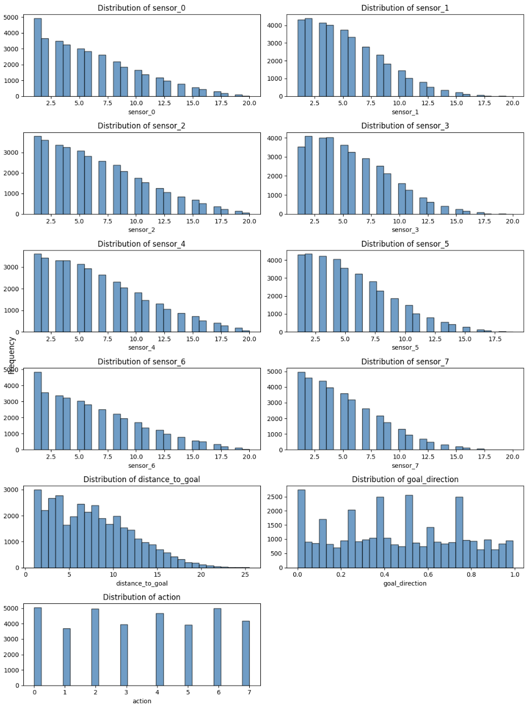
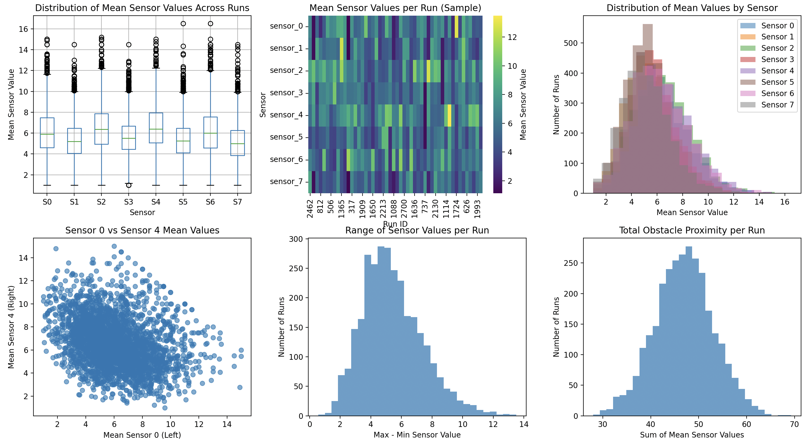
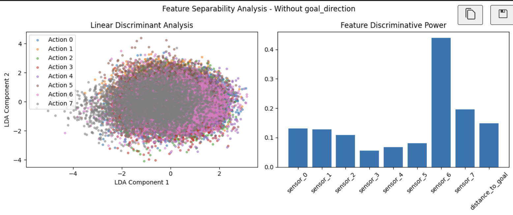
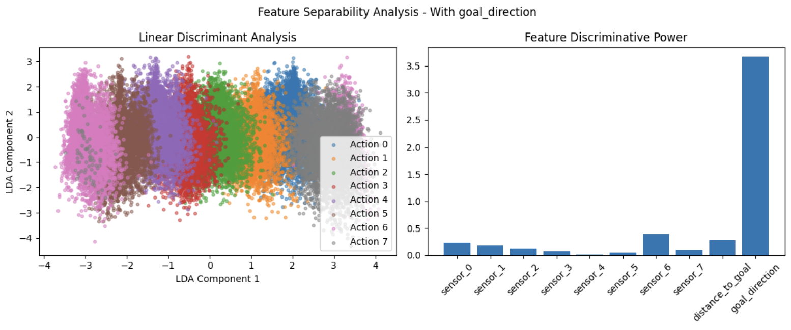
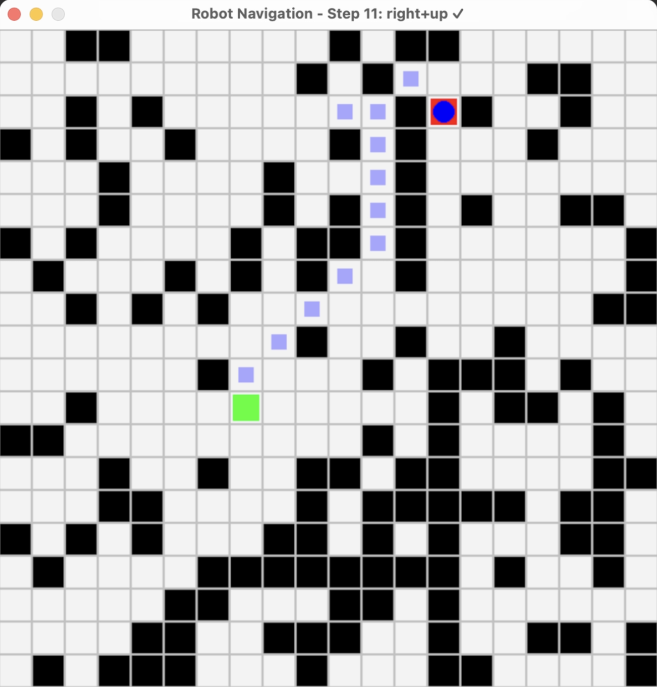
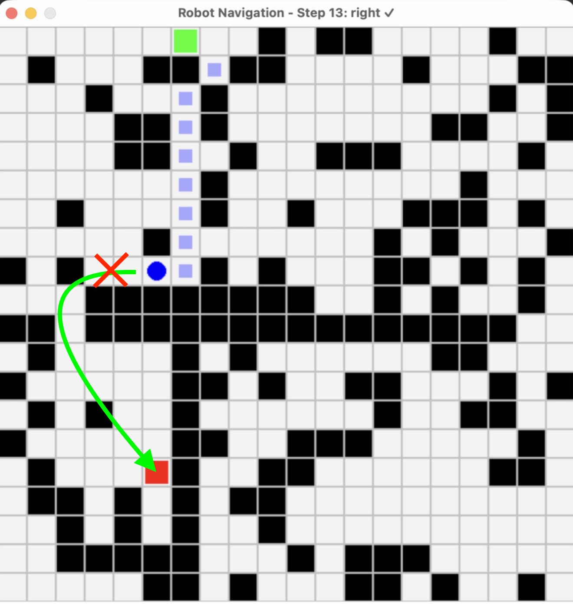

Learning Based Navigation for Robots in Random 2D Worlds
Max Boulat, Tanya Neustice, and Dylan Scott-Dawkins
Department of Engineering, San Diego University
AAI-501-01: Introduction to Artificial Intelligence Andrew Van Benschoten
August 11, 2025

# Abstract

Autonomous navigation through complex environments is a fundamental challenge in robotics and artificial intelligence. This project explores whether a robot can learn to navigate in a randomly generated two-dimensional world with obstacles using supervised learning. A world generator creates 2D maps populated with single-tile obstacles and random linear walls; an agent equipped with eight radial sensors is tasked with navigating between two randomly selected points while avoiding obstacles. An A\* path-planner produces optimal actions, which serve as the supervisory signal for training. We perform exploratory data analysis and evaluate multiple classification algorithms—including Random Forest, XGBoost, logistic regression, support vector machines, Naïve Bayes, K-nearest neighbors and a neural network—on the resulting dataset. We find that a wide variety of machine learning models are capable of generalizing obstacle avoidance and goal seeking behavior with the right features.

Keywords: Autonomous Navigation, Supervised Learning, Path Planning, Sensor-Based Perception, Classification Algorithms

# Robots in Random 2D Worlds

AI models capable of navigating partially observable environments under uncertainty have significant potential across various fields, including self-driving cars, exploration, search and rescue missions and military uses.

In this study, we investigate whether a robot can learn to navigate random two-dimensional environments with obstacles using supervised learning. Using A\* as an expert, we generate trajectories and collect sensor readings and actions. We then train a variety of classification models to predict the next move from sensor input, compare their performance and discuss the inherent limitations. Our objectives are to:

1. Define an artificial world and sensor model suitable for machine-learning experiments.
2. Generate a labelled dataset by following optimal paths computed by A\*.
3. Analyze the dataset to understand feature distributions, correlations and potential issues such as label contradictions.
4. Train and evaluate different machine-learning algorithms on the navigation problem.

# 2. Literature review

The difficulty of learning navigation policies from supervised data is well recognized in the literature. Pomerleau’s ALVINN system imitated human steering by training on camera and laser readings; while promising, it worked only on simple road scenes and suffered when the environment changed (1988). Kaelbling, Littman and Cassandra formalized POMDPs (Partially Observable Markov Decision Processes), highlighting the challenge of acting under partial observability (1998). Later, Ross et al. introduced DAgger, an imitation-learning algorithm that addresses distribution shift by iteratively collecting expert feedback along the learner’s own trajectories (2011).

Hausknecht and Stone proposed the Deep Recurrent Q-Network (DRQN) to handle partially observable environments by maintaining a hidden state over time (2015). These architectures are especially suited for environments requiring memory of past observations. Such recurrent architectures could enable agents to accumulate information about the goal’s direction across multiple steps. Tamar et al. introduced **Value Iteration Networks (VIN)**, neural networks that embed a differentiable planning module and learn to perform approximate value iteration (2017). VINs have been applied to grid-world navigation and could provide a more principled way to combine local observations with implicit planning. More recent work such as Neural Map (Parisotto & Salakhutdinov, 2017) incorporates external memory to build an internal map, which is critical when the task requires exploration and recall of previously visited locations.

Codevilla et al. (2019) show that behavior-cloned policies with high action agreement can still crash because they lack planning and fail to recover from mistakes. Therefore, evaluation metrics should include path efficiency, collision rates and goal success rather than solely action prediction accuracy. Our use of accuracy and F1 score provides a first assessment but does not fully capture navigation quality.

## 3. Methodology

### 3.1 World generation and sensors

The environment is a bounded square grid of size 20×20. A world generator populates the grid with single-tile obstacles based on a probability (`obstacle_prob = 0.2`) and adds several horizontal or vertical walls of random lengths. The start and goal locations are randomly selected so that the Euclidean distance between them is at least eight cells and neither lies on an obstacle. Each simulation generates a new world, ensuring a diverse set of layouts. The agent can move in eight directions corresponding to the Moore neighborhood (N, NE, E, SE, S, SW, W, NW).

To navigate, the agent initially received local information solely from eight radial distance sensors. Each sensor reports the number of unobstructed tiles from the agent’s position in one of eight directions, up to the nearest wall or obstacle. As part of our methodology to improve learning performance, we incrementally introduced additional features.

First, we added the Euclidean distance to the goal, giving the agent a global sense of how far it remained from its objective. This feature provided useful context that wasn't captured by the local sensors alone, helping guide movement decisions more effectively.

We then added goal direction as computed angle in radians between the agent and the goal to give more spatial context.

With these enhancements, the final raw state representation consisted of sensor_0 to sensor_7, the distance_to_goal, and the goal_direction and the target variable was the action chosen by A\*—an integer from 0 to 7 representing one of the eight possible moves.

### 3.2 Data generation using A\*

A\* search uses a priority queue to explore nodes with the lowest estimated total cost (the cost so far plus a heuristic). We use the Euclidean distance to the goal as the heuristic. When constructing the dataset, we run A\* on each randomly generated world to compute an optimal path from the start to the goal. For every step along the path, we record the timestamp, run identifier, current position, the eight sensor readings, the Euclidean distance to the goal, the goal direction and the action taken. Listing 1 summarizes the data schema.

| **Column**                 | **Description**                                                            |
| -------------------------- | -------------------------------------------------------------------------- |
| `timestamp`                | Global index across all runs                                               |
| `run_id`                   | Simulation run identifier                                                  |
| `position_x`, `position_y` | Agent’s coordinates (not used as features)                                 |
| `sensor_0…sensor_7`        | Distances to nearest obstacle in eight directions                          |
| `distance_to_goal`         | Euclidean distance to goal                                                 |
| `path_length`              | Steps taken so far                                                         |
| `goal_direction`           | The calculated angle between the current position and the goal, in radians |
| `action`                   | Optimal move (0–7) as determined by A\*                                    |

We generated multiple batches of data:

- action_sensor+dist: Sample size 3000 runs (35,452 labelled instances), no `goal_drection`
- action_sensor+dist_dir: Sample size 3000 runs (35,452 labelled instances), `goal direction` as a feature
- action_sensor+dist_dir_10k: Sample size 10000 runs (118211 labelled instances), `goal direction` as a feature
- action_sensor+dist_dir_10k_3walls: Sample size 10000 runs (118211 labelled instances), `goal direction` as a feature with 3 walls

### 3.3 Evaluation metrics and performance criteria

To evaluate the models and compare them, we primarily used accuracy scores. Accuracy scores measure the percentage of correct predictions made by the model on a test dataset. It is a good first-line estimator of capabilities although it does have limitations when the classes are imbalanced. However since our EDA shows that our classes are well-balanced, accuracy is an appropriate metric.

In addition, we used a simulator to observe the trained models navigate new randomly generated worlds in real time.

### 3.3 Exploratory data analysis

#### 3.3.1 Distributions

We performed exploratory data analysis (EDA) on the dataset to understand feature distributions and potential issues.

Figure 1 shows the distribution of each variable in the dataset.

We observe that all sensor readings, and distance to goal are right skewed distributions, reflecting the prevalence of smaller distances and the diminishing frequency of larger distances in the readings.

The distribution of the action variable is well balanced across all 8 possible actions, with a slight convergence of the lateral/vertical actions over the diagonal ones. The balanced action distribution reduces class imbalance issues during training.

#### 3.3.2 Run level variability

To ensure that world configurations are evenly represented across runs, we conducted a comprehensive run variability study.

The absence of distribution skew across sensors shows a good representation of world configurations across runs.

### 3.4 Shifting-signals problem and information asymmetry

An important observation from EDA is that identical sensor readings can correspond to different optimal actions depending on the global arrangement of obstacles and the relative position of the goal. For example, two states with the same local obstacles may require moving northeast in one case and southwest in another if the goal lies in different directions. A\* can resolve this because it has global knowledge of the grid, but the machine-learning model sees only local distances and a scalar goal distance. This **information asymmetry** leads to **shifting signals**: identical inputs with opposite labels.

To quantify this phenomenon, we grouped training samples by sensor value patterns, and counted the percentage of unique patterns which had conflicting action labels with and without goal direction. We found that 31.7% of the patterns had conflicts without goal direction whereas only 8.8% had conflicts with goal direction.

To help visualize the problem further, we performed a full-fledged feature uniqueness analysis.

This shows that in the absence of goal direction information, the model leans on a arbitrary feature (sensor 6) as the discriminant feature and is not able to clearly discriminate between actions. Once goal direction is added, the actions are are clearly differentiated and the goal direction becomes the dominating discriminant.

without goal direction:

with goal direction:

# 4 Model selection and training

## 4.1 Overview

We compared a selection of classification models in scikit-learn and the XGBoost library. All models were trained to output the optimal action based on the eight sensor distances and goal distance. We performed stratified 80/20 train-tests, so each action class was present in each subset approximately in proportion. The models and their training parameters were:

**Random Forest** – Chosen due to its stability and ability to capture non-linear interactions between features without extensive preprocessing. Its ensemble nature provides it with a solid baseline for tabular data.

**XGBoost** – Included due to its success in structured data competitions. It can handle non-linear relationships and has the ability to produce calibrated class probabilities using the mlogloss objective.

**Logistic Regression** – Simple and interpretable linear model used as a baseline for multi-class classification. We used the multinomial variant with the LBFGS solver and boosted training (max_iter = 1000) to ensure convergence.

**Support Vector Machine (SVM)** – With an RBF kernel, SVMs can generalize hard decision boundaries. SVMs are useful when the decision boundary between classes is smooth, yet non-linear.

**Naïve Bayes** – Chosen for its performance and simplicity, although it makes strong independence assumptions. It can be used as a baseline against which to compare.

**K-nearest neighbors (KNN)** – A non-parametric method with no distributional assumptions about the data. It is good at learning local structure but will struggle with noisy or high-dimensional data.

**Neural Network (MLP)** – A multi-layer perceptron with multiple layers of hidden units using ReLU activations. This architecture has sufficient capacity to learn complex non-linear patterns in the sensor signals.

## 4.2 Choosing Appropriate Algorithm Structures

Selecting the right structure for the various AI selected models, for example, the neural network architecture is a critical part of our methodology. The structure of the network—including the number of layers, the number of units per layer, activation functions, and regularization strategies—can significantly affect the model's ability to learn from the input features and generalize to new environments.

We approached architecture selection empirically, starting with simple fully connected (feed-forward) networks and adjusting based on performance. Shallower networks tended to underfit the problem, especially once we introduced more nuanced features like distance_to_goal and normalized direction vectors. Deeper architectures provided the capacity to model more complex relationships between inputs and the optimal actions, but came with increased risk of over-fitting. We mitigated this using techniques such as dropout, early stopping, and batch normalization.
The choice of output representation (categorical vs. continuous ŷ) also influenced architecture decisions. For classification targets, a `softmax` output layer paired with cross-entropy loss was appropriate. For continuous direction vectors, we used a linear output layer and optimized with mean squared error (MSE). In both cases, the architecture had to align with the nature of the prediction target to ensure stable and effective learning.

This iterative tuning of network structure was essential to achieving reliable performance and forms a core part of our methodology.

## 5 Results

| Model                  | goal_dist_3k | goal_dist+goal_dir_3k | dist+goal_dir_10k | dist+goal_dir_3walls_10k |
| ---------------------- | ------------ | --------------------- | ----------------- | ------------------------ |
| Random Forest          | 0.379        | **0.891**             | **0.889**         | 0.848                    |
| XGBoost                | **0.436**    | 0.885                 | **0.889**         | **0.849**                |
| Support Vector Machine | 0.343        | 0.844                 | 0.859             | 0.812                    |
| Neural Network (MLP)   | 0.347        | 0.867                 | 0.881             | 0.838                    |
| Logistic Regression    | 0.229        | 0.602                 | 0.592             | 0.548                    |
| Naïve Bayes            | 0.233        | 0.787                 | 0.781             | 0.679                    |
| K-Nearest Neighbors    | 0.279        | 0.588                 | 0.626             | 0.622                    |

The table above shows each model's accuracy on the dataset versions for the held-out test set.
The addition of goal direction to the distance features gives significant performance boosts to all the models.
Comparing, for example, the goal_dist_3k dataset with the `goal_dist+goal_dir_3k` dataset, Random Forest accuracy goes from 0.379 to 0.891, while Naïve Bayes goes from 0.233 to 0.787. Among models compared, Random Forest and XGBoost are the most consistently top-performing models across dataset configurations, with a high performance in larger datasets in particular, such as both achieving 0.889 accuracy on `dist+goal_dir_10k`. The Neural Network (MLP) also performs strongly, with 0.881 and 0.838 on the 10k datasets. Support Vector Machine is also assisted by the extra directional features but tends to fall behind ensemble methods, with a best accuracy of 0.859. Logistic Regression and K-Nearest Neighbors lag consistently behind, especially as the datasets become more complex. Doubling the size of the dataset from 3k to 10k samples gives moderate accuracy gains to most models—for instance, the Neural Network goes from 0.867 to 0.881, and the SVM from 0.844 to 0.859. But introducing walls into the worlds (`dist+goal_dir_3walls_10k`) reduces accuracy for a majority of models by some extent, due to greater complexity in navigating around walls; e.g., Random Forest accuracy drops from 0.889 to 0.848, and that of XGBoost from 0.889 to 0.849.

We were able to visualize the decision-making abilities of the various models by loading the model's prediction function into the simulator and presenting it with new randomly generated worlds. The green square represents the starting point, the red square represents the goal, the solid blue circle is the agent and the lighter blue square represent the successive positions of the agent as it navigates.

The models demonstrated generalization to novel maze configurations, effectively avoiding illegal moves (e.g., walking into walls) and progressing toward goals. This suggests that the models have learned underlying spatial heuristics rather than memorizing training trajectories.

It is interesting to note that even though the trained models were able to emulate A\* behavior when the solution did not involve bypassing large obstacles, their ability to reason their way around obstacles broke down when the path involved moving more than 3-4 tiles away from the goal direction.

### Selecting Neural Network Architecture

To observe how neural network architecture influences performance on our dataset, we experimented with several multi-layer perceptron (MLP) setups by varying both the number of layers (2 vs. 3) and the number of neurons per layer (16 to 256). We chose the more difficult dataset of `dist+goal_dir_3walls_10k`
to see if we could extract any further performance. We observe that 2-layer MLPs perform better than deeper 3-layer ones, with the highest performance (0.846 accuracy) achieved by the [64, 32] setup. Wider architectures like [128, 64] and [256, 128] performed worse, possibly due to over-fitting or less generalization capacity for the dataset size.

| Architecture | Layer Sizes      | Accuracy  |
| ------------ | ---------------- | --------- |
| 2-layer MLP  | \[16, 32]        | 0.839     |
| 2-layer MLP  | \[32, 16]        | 0.840     |
| 2-layer MLP  | \[64, 32]        | **0.846** |
| 2-layer MLP  | \[32, 64]        | 0.844     |
| 2-layer MLP  | \[128, 64]       | 0.835     |
| 2-layer MLP  | \[256, 128]      | 0.808     |
| 3-layer MLP  | \[64, 32, 16]    | 0.842     |
| 3-layer MLP  | \[16, 32, 64]    | 0.840     |
| 3-layer MLP  | \[128, 64, 32]   | 0.828     |
| 3-layer MLP  | \[256, 128, 64]  | 0.804     |
| 3-layer MLP  | \[128, 128, 128] | 0.800     |
| 3-layer MLP  | \[256, 256, 256] | 0.804     |

On the other hand, the 3-layer MLPs did not perform better than their 2-layer versions and, in most cases, had slightly worse accuracy. The best-performing 3-layer model, [64, 32, 16], had 0.842 accuracy, which is close but still worse than the optimal 2-layer score. Wider and deeper 3-layer models like [128, 128, 128] and [256, 256, 256] had even worse accuracies (0.800–0.804), showing that increased depth and width do not necessarily lead to increased performance and may also lead to optimization problems or overfitting.

In addition, funnel-shaped architectures (i.e., decreasing width between layers) performed slightly better than flat or expanding ones. For example, [64, 32, 16] performed better than [16, 32, 64] despite having the same total number of neurons. This suggests that it could be helpful to slowly reduce the representational capacity while moving towards the output to force the network to focus and generalize more.

Overall, these findings indicate that shallower networks with fewer layers and medium width are more suitable for this dataset. Depth and width must both be carefully tuned, especially when there is limited training data or minimal regularization.

## 6. Discussion

=======
// Max and Dylan to rewrite this

Dylan:

The results demonstrate that introducing goal direction as a feature yields substantial performance gains across all models, particularly for otherwise uncertain sensor input situations. Ensemble methods, specifically Random Forest and XGBoost, posted the highest and most consistent accuracies, with both achieving 0.889 on the `dist+goal_dir_10k` dataset, indicating their robustness to moderately elevated environmental complexity. The Neural Network also performed well, achieving competitive performance with ensembles, and SVMs improved with the extra directional context but remained slightly less competitive. These results highlight the fact that providing richer spatial information greatly reduces label conflicts arising due to information asymmetry. However, the decrease in performance in the `dist+goal_dir_3walls_10k` condition reveals deficiency in partial observability and more complex obstacle situations, where local distance sensors, especially noisy sensors, cannot fully sense the global navigational space. This means that subsequent research will need to explore more sophisticated representations, such as the application of learned spatial embeddings, memory-based networks, or noise-robust sensor fusion, and, in parallel, the addition of additional sensors to expand the observability field and engineering more features to encode relevant spatial and temporal information. These features could potentially allow models to generalize more abstractly about unseen barriers, reduce the impact of noisy measurements, and stabilize decisions in adverse conditions.

### 7 Future Work

======
Max:

Given the constraints we set out, I think we have maximize the capabilities of AI models to solve the problem, and that the next steps would involved:

- making the world more complex
- adopting the kind of techniques mentioned in the literature review (the more advanced techniques like Alpha Star)

I would want to investigate the obstacle avoidance problem (the limitations of what we have achieved is that it doesn't know how to plan)

======
Dylan

Within the limits we established, our current approach has pushed the acuity of supervised AI models close to the limits for this task. Future efforts must include increasing the complexity of the environment and adopting more advanced learning paradigms that can handle planning, partial observability, and varied or noisy sensor inputs. On the environment side, this includes making the worlds progressively more complex—incorporating additional obstacles, varied layouts, and more challenging navigation constraints—to better mirror real-world environments. Incorporating additional sensors and features to provide richer spatial and temporal information, such as relative goal angles, local occupancy patterns, or derived spatial embeddings, could also reduce label ambiguity and improve performance.
On the modeling front, future work needs to investigate architectures better suited to spatial and temporal reasoning. **Convolutional Neural Networks (CNNs)** can exploit local spatial patterns if sensor data is represented as a grid, while **Recurrent Neural Networks (RNNs) or LSTMs** can integrate observations over time to maintain an implicit belief state, enabling more effective decision-making in partially observable Markov decision processes (POMDPs). **Graph Neural Networks (GNNs)** are a way of reasoning about topological structures, i.e., grids with obstacle connectivity. Beyond imitation learning, **reinforcement learning approaches**—i.e., **Q-learning**, **Deep Q-Networks (DQN)**, **Proximal Policy Optimization (PPO)**, and even hierarchical planning systems like those used in **AlphaStar**—would allow agents to learn adaptive policies from reward signals directly, enabling true obstacle avoidance and goal-directed planning rather than simply imitating A\\\* outputs.

Finally, more advanced imitation learning approaches such as **DAgger** would combat distribution shift by having the expert queried in states visited by the learned policy, which gives broader coverage of state space. Collectively, these approaches—feature engineering, sensors that are more informative, temporal modeling, and reinforcement learning—offer a path towards agents that plan, adapt, and navigate effectively in increasingly complex and noisy environments.

=======
Original:

- **Reduce sensor range** to two or three tiles to encourage repeated patterns and limit the feature space. This would make nearest-neighbor methods more meaningful and reduce contradictions.
- **Augment features** with the relative angle to the goal rather than just the Euclidean distance; this provides directional context without revealing the entire map.
- **Incorporate memory** using recurrent networks (e.g., LSTM) to aggregate information across multiple steps. Such models can build an implicit belief about the environment, analogous to DRQN for POMDPs.
- **Use imitation-learning algorithms such as DAgger**, which query the expert for additional labels when the learner deviates. This ensures that data covers states likely under the learned policy and reduces distribution shift.

======

## 8 Conclusion

======
Rewrite this:

This project investigated whether an agent could learn to navigate randomly generated two-dimensional worlds with obstacles using supervised learning. By generating a dataset of optimal actions via A\* and training multiple classifiers, we found that the problem is inherently ill-posed. Identical sensor inputs often correspond to different optimal moves because of the agent’s limited field of view and the influence of the goal’s location. Consequently, even high-capacity models such as Random Forest and XGBoost achieve only ~0.37 accuracy, and other methods perform worse. The experience underscores the limitations of behavior cloning in partially observable environments and highlights the need for algorithms that incorporate planning, memory and exploration. Future work should consider imitation-learning algorithms that handle distribution shift, recurrent architectures, differentiable planners and reinforcement learning to overcome the information asymmetry and achieve robust navigation.

=======

# References

- Barreto, A., Dabney, W., Munos, R., Hunt, J. J., Schaul, T., van Hasselt, H., & Silver, D. (2018). Successor features for transfer in reinforcement learning. _arXiv_. <https://arxiv.org/abs/1606.05312>

- Codevilla, F., Santana, E., López, A. M., & Gaidon, A. (2019). Exploring the limitations of behavior cloning for autonomous driving. _arXiv_. <https://arxiv.org/abs/1904.08980>

- Delgado, K. V., de Barros, L. N., Dias, D. B., & Sanner, S. (2016). Real-time dynamic programming for Markov decision processes with imprecise probabilities. _Artificial Intelligence, 230_, 192-223. <https://doi.org/10.1016/j.artint.2015.09.005>

- Hausknecht, M. J., & Stone, P. (2015). _Deep recurrent Q-learning for partially observable MDPs_. arXiv. <http://arxiv.org/abs/1507.06527>

- Kaelbling, L. P., Littman, M. L., & Cassandra, A. R. (1998). Planning and acting in partially observable stochastic domains. _Artificial Intelligence, 101_(1), 99–134. <https://doi.org/10.1016/S0004-3702(98)00023-X>

- Mathieu, M., Ozair, S., Srinivasan, S., Gulcehre, C., Zhang, S., Jiang, R., Le Paine, T., Powell, R., Żołna, K., Schrittwieser, J., Choi, D., Georgiev, P., Toyama, D., Huang, A., Ring, R., Babuschkin, I., Ewalds, T., Bordbar, M., Henderson, S., ... Vinyals, O. (2023). AlphaStar Unplugged: Large-scale offline reinforcement learning. _arXiv_. <https://arxiv.org/abs/2308.03526>

- Parisotto, E., & Salakhutdinov, R. (2017). Neural Map: Structured memory for deep reinforcement learning. _arXiv_. <https://arxiv.org/abs/1702.08360>

- Petrović, L. (2018). Motion planning in high-dimensional spaces. _arXiv_. <https://arxiv.org/abs/1806.07457>

- Pomerleau, D. A. (1988). ALVINN: An autonomous land vehicle in a neural network. In D. Touretzky (Ed.), _Advances in Neural Information Processing Systems_ (Vol. 1). Morgan Kaufmann. <https://proceedings.neurips.cc/paper_files/paper/1988/file/812b4ba287f5ee0bc9d43bbf5bbe87fb-Paper.pdf>

- Ross, S., Gordon, G. J., & Bagnell, J. A. (2011). A reduction of imitation learning and structured prediction to no-regret online learning. _arXiv_. <https://arxiv.org/abs/1011.0686>

- Tamar, A., Wu, Y., Thomas, G., Levine, S., & Abbeel, P. (2017). Value iteration networks. _arXiv_. <https://arxiv.org/abs/1602.02867>

- Xia, F., Li, C., Chen, K., Shen, W. B., Martín-Martín, R., Hirose, N., Zamir, A. R., Fei-Fei, L., & Savarese, S. (2019, June 16). Gibson Env V2: Embodied simulation environments for interactive navigation (Tech. Rep.). _Stanford University_. <http://svl.stanford.edu/gibson2>
