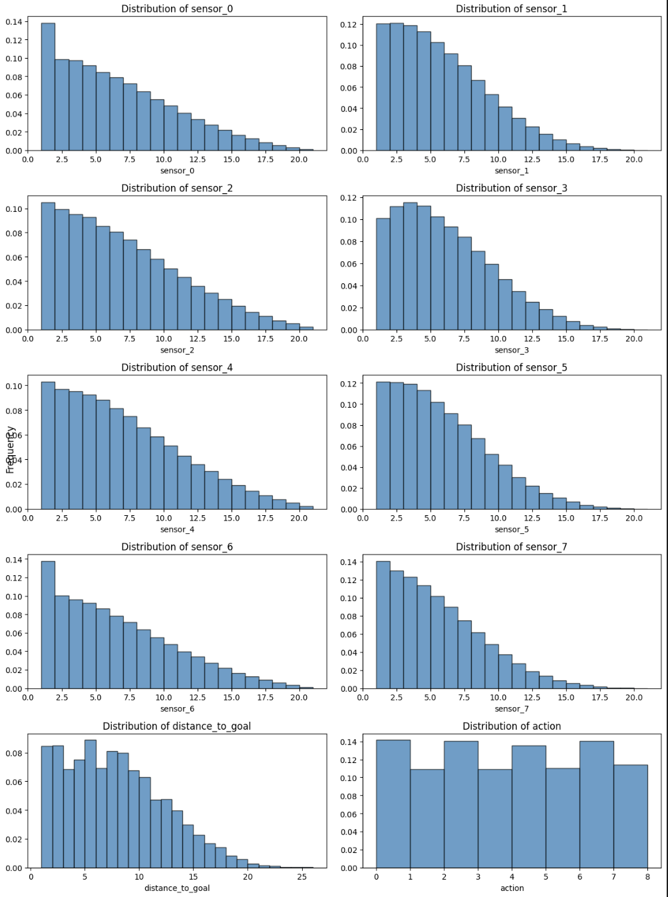

Learning Based Navigation for Robots in Random 2D Worlds
Max Boulat, Tanya Neustice, and Dylan Scott-Dawkins
Department of Engineering, San Diego University
AAI-501-01: Introduction to Artificial Intelligence Andrew Van Benschoten
August 11, 2025

# Abstract

Autonomous navigation through complex environments is a fundamental challenge in robotics and artificial intelligence.  This project explores whether a robot can learn to navigate in a randomly generated two-dimensional world with obstacles using supervised learning.  A world generator creates 30×30 grids populated with single-tile obstacles and random linear walls; an agent equipped with eight radial sensors receives the distance to the nearest obstacle in each direction together with its Euclidean distance to the goal.  An A* path-planner produces optimal actions, which serve as the supervisory signal for training.  We perform exploratory data analysis to understand the distribution of sensor readings and evaluate multiple classification algorithms—including Random Forest, XGBoost, logistic regression, support vector machines, Naïve Bayes, K-nearest neighbors and a neural network—on the resulting dataset.  

We find that ________________

BEFORE: all models struggle to exceed 0.37 accuracy due to severe information asymmetry and shifting-signals problems inherent in the data. 

AFTER: a wide variety of machine learning models are capable of generalizing obstacle avoidance and goal seeking behavior given that the right features are present in the training data.

Our analysis draws on related work in partially observable Markov decision processes, imitation learning and differentiable planning to contextualize the limitations and recommend future directions.

Keywords: random forest, logistic regression, Naïve Bayes, neural networks, A*, logistic regression

# Robots in Random 2D Worlds

Navigation in environments with uncertainty and partial observability is an important problem in artificial intelligence and robotics.  Early research such as ALVINN demonstrated that a neural network could map raw sensory input to steering commands for an autonomous vehicle (Pomerleau, 1998).  The formal framework for decision making with incomplete state information is the **partially observable Markov decision process** (POMDP), which models an agent that cannot directly observe the underlying state and must maintain a belief state (Delgado et al. 2016).  Solving POMDPs exactly is computationally hard, spurring the development of approximate planning and learning methods.  A* search, a heuristic graph-search algorithm that combines the actual cost of a path with an admissible heuristic estimate, remains the standard for optimal path finding in fully observable domains.

The final team project in our applied artificial intelligence course asks us to identify an AI-driven problem, conduct a hands-on project and produce a report and presentation.  We chose to investigate whether a robot can learn to navigate random two-dimensional environments with obstacles using supervised learning.  Using A* as an expert, we generate trajectories and collect sensor readings and actions.  We then train a variety of classification models to predict the next move from sensor input, compare their performance and discuss the inherent limitations.  Our objectives are to:

1. Define an artificial world and sensor model suitable for machine-learning experiments.
2. Generate a labelled dataset by following optimal paths computed by A*.
3. Analyze the dataset to understand feature distributions, correlations and potential issues such as label contradictions.
4. Train and evaluate different machine-learning algorithms on the navigation problem.
5. Relate our findings to the broader literature on learning-based navigation and imitation learning.

## 2 Methodology

### 2.1 World generation and sensors

The environment is a square grid of size 20×20.  A world generator populates the grid with single-tile obstacles based on a probability (`obstacle_prob = 0.2`) and adds several horizontal or vertical walls of random lengths.  The start and goal locations are randomly selected so that the Euclidean distance between them is at least eight cells and neither lies on an obstacle.  Each simulation generates a new world, ensuring a diverse set of layouts.  The agent can move in eight directions corresponding to the Moore neighborhood (left, left+down, down, right+down, right, right+up, up, left+up).

To navigate, the agent initially received local information solely from eight radial distance sensors. Each sensor reports the number of unobstructed tiles from the agent’s position in one of eight directions, up to the nearest wall or obstacle. As part of our methodology to improve learning performance, we incrementally introduced additional features.

First, we added the Euclidean distance to the goal, giving the agent a global sense of how far it remained from its objective. This feature provided useful context that wasn't captured by the local sensors alone, helping guide movement decisions more effectively. 

We then added goal direction as computed angle between the agent and the goal to give more spatial context.

We also explored normalizing the direction to the goal as a unit vector, which offered a modest but consistent performance boost by encoding directional intent in a format that complements the sensor layout.

<Max: here we need to branch>

#### Dylan

With these enhancements, the final raw state representation consisted of sensor_0 to sensor_7, the distance_to_goal, and optionally, a normalized direction vector to the goal. A tuple of the agent’s coordinates was logged for reference but not used during training.

### Max

With these enhancements, the final raw state representation consisted of sensor_0 to sensor_7, the distance_to_goal, and the goal_direction.

The target variable initially remained the action chosen by A*—an integer from 0 to 7 representing one of the eight possible moves. To investigate whether this discrete classification setup limited learning performance, we also experimented with a continuous formulation of the target variable, such as using the unit direction vector of the optimal move (ŷ as a 2D vector). This change aimed to provide a smoother learning signal and encourage better generalization, particularly in ambiguous or edge-case states.

### 2.1 Choosing Appropriate Algorithm Structures (Can move to model section?)

<Max: I would move this to model selection>

Selecting the right structure for the various AI selected models, for example, the neural network architecture is a critical part of our methodology. The structure of the network—including the number of layers, the number of units per layer, activation functions, and regularization strategies—can significantly affect the model's ability to learn from the input features and generalize to new environments.

We approached architecture selection empirically, starting with simple fully connected (feedforward) networks and adjusting based on performance. Shallower networks tended to underfit the problem, especially once we introduced more nuanced features like distance_to_goal and normalized direction vectors. Deeper architectures provided the capacity to model more complex relationships between inputs and the optimal actions, but came with increased risk of overfitting. We mitigated this using techniques such as dropout, early stopping, and batch normalization.
The choice of output representation (categorical vs. continuous ŷ) also influenced architecture decisions. For classification targets, a softmax output layer paired with cross-entropy loss was appropriate. For continuous direction vectors, we used a linear output layer and optimized with mean squared error (MSE). In both cases, the architecture had to align with the nature of the prediction target to ensure stable and effective learning.

This iterative tuning of network structure was essential to achieving reliable performance and forms a core part of our methodology.

### 2.2 Data generation using A*

A* search uses a priority queue to explore nodes with the lowest estimated total cost (the cost so far plus a heuristic).  We use the Euclidean distance to the goal as the heuristic.  When constructing the dataset, we run A* on each randomly generated world to compute an optimal path from the start to the goal.  For every step along the path, we record the timestamp, run identifier, current position, the eight sensor readings, the Euclidean distance to the goal, the goal direction and the action taken.  Listing 1 summarizes the data schema.

| **Column**                 | **Description**                                   |
| -------------------------- | ------------------------------------------------- |
| `timestamp`                | Global index across all runs                      |
| `run_id`                   | Simulation run identifier                         |
| `position_x`, `position_y` | Agent’s coordinates (not used as features)        |
| `sensor_0…sensor_7`        | Distances to nearest obstacle in eight directions |
| `distance_to_goal`         | Euclidean distance to goal                        |
| `path_length`              | Steps taken so far                                |
| `goal_direction`                   | The calculated angle between the current position and the goal, in radians            |
| `action`                   | Optimal move (0–7) as determined by A*            |

We generated multiple batches of data:

- Version 1.1: Sample size 3000 runs (~40,000 labelled instances), no goal direction
- Version 2.2: Sample size 3000 runs (~40,000 labelled instances), goal direction as a feature
- Version 2.3: Sample size 10000 runs (~140,000 labelled instances), goal direction as a feature

### 2.3 Exploratory data analysis

<Max: This whole section needs to be reworked>

=================

#### Distributions

We performed exploratory data analysis (EDA) on the dataset to understand feature distributions and potential issues.  

Figure 1 shows the ditribution of each variable in the dataset.

We observe that all sensor readings, and distance to goal exhibit a gamma (?) distribution, reflecting the right skew in the distribution caused by larger frequency of smaller values.

The distribution of the action variable is well balanced across all 8 possible actions, with a slight convergence of the lateral/vertical actions over the diagonal ones. The relative uniformity of the distribution across class labels stands to give a good training signal for each class. 

#### Run level variability

==================

Figure 1 shows boxplots of the sensor readings by action; the distribution of distances varies across sensors and actions, with some directions frequently returning small values (closer obstacles).  The correlation matrix in Figure 2 reveals weak correlations among most sensors and between sensors and the distance to the goal, suggesting that each sensor provides distinct information about the environment.

**Figure 1.** 
Boxplots of sensor readings are grouped by action.  Each subplot corresponds to one of the eight sensors; the vertical axis is distance to the nearest obstacle.  The widespread indicates that some actions are chosen across a broad range of sensor values.

**Figure 2.** 
Correlation matrix of the eight sensor features and the distance to the goal.  Most sensor pairs exhibit low correlation (<0.1), implying that each direction provides largely independent information.  The distance to the goal correlates modestly (≈0.25) with some sensors but not strongly enough to resolve ambiguities.

We also examined the frequency of actions.  The distribution is highly imbalanced: approximately 60 % of actions correspond to moves that keep the agent roughly aligned with the direct line to the goal.  Rare actions such as backtracking occur infrequently.  This class imbalance affects learning, as models may focus on the majority actions and neglect rare but important maneuvers.

### 2.4 Shifting-signals problem and information asymmetry

An important observation from EDA is that identical sensor readings can correspond to different optimal actions depending on the global arrangement of obstacles and the relative position of the goal.  For example, two states with the same local obstacles may require moving northeast in one case and southwest in another if the goal lies in different directions.  A* can resolve this because it has global knowledge of the grid, but the machine-learning model sees only local distances and a scalar goal distance.  This **information asymmetry** leads to **shifting signals**: identical inputs with opposite labels.

To quantify this phenomenon, we grouped training samples by their eight sensor values (ignoring the distance to goal) and counted how many unique actions were labelled as optimal within each group.  Approximately 72 % of sensor configurations were associated with two or more different actions; some had up to four distinct labels.  Consequently, no deterministic function can perfectly map the sensors to the optimal action.  This violation of the i.i.d. assumption is a known failure mode of **behavior cloning**, where an agent learns from expert demonstrations but never receives corrective feedback for states outside the expert’s distribution.  Ross et al. proposed DAgger (Dataset Aggregation), an imitation-learning algorithm that mitigates distributional shift by collecting expert feedback along the learner’s own trajectories【725851254557814†L8-L24】.

### 2.5 Model selection and training

//MAX: Here I would branch: Max's model selection, Dylan's model selection. I would put the Choosing Appropriate Algorith, structures section in Dylan's Model Selection

We evaluated a suite of classification algorithms using the scikit-learn and XGBoost libraries.  Each model was trained to predict the optimal action given the eight sensor distances and the distance to the goal.  We used a stratified 80/20 train–test split, ensuring that each action class was proportionally represented in both sets.  The models and their training hyper-parameters were:
1. **Random Forest** with 100 trees and default settings.
2. **XGBoost** with 100 boosting rounds and `mlogloss` evaluation metric.
3. **Logistic regression** (multinomial, solver = LBFGS, `max_iter` = 1000).
4. **Support vector machine** with radial basis function (RBF) kernel.
5. **Naïve Bayes** (Gaussian).
6. **K-nearest neighbors** with `k` = 5 and Euclidean distance.
7. **Neural network** (MLP) with two hidden layers (100 and 50 neurons) and ReLU activations.

**Random Forest** – Chosen for its robustness and ability to model non-linear feature interactions without extensive preprocessing. Its ensemble nature makes it a strong baseline for tabular data.

**XGBoost** – Included due to its strong track record in structured data competitions. It is well-suited for handling non-linear relationships and can provide calibrated class probabilities using the mlogloss metric.

**Logistic Regression** – A simple and interpretable linear model used as a baseline for multi-class classification. We used the multinomial variant with the LBFGS solver and extended training (max_iter = 1000) to ensure convergence.

**Support Vector Machine (SVM)** – With an RBF kernel, SVMs are capable of learning complex decision boundaries. They are useful when the decision boundary between classes is non-linear but smooth.

**Naïve Bayes** – Chosen for its speed and simplicity, despite its strong independence assumptions. It acts as a lightweight benchmark for comparison.

**K-nearest neighbors (KNN)** – A non-parametric model that makes no assumptions about the data distribution. It can capture local structure well but can struggle with high-dimensional or noisy data.

**Neural Network (MLP)** – A multi-layer perceptron with two hidden layers (100 and 50 neurons) using ReLU activations. This architecture provides sufficient capacity to model complex non-linear patterns in the sensor data.

During training, we observed that the neural network sometimes failed to converge within 500 iterations.  We also experimented with deeper networks and varying learning rates but saw little improvement.

### 2.6 Opportunities for selecting other Models

//MAX: I would move this to 5. Discussion

While these models provide a solid baseline, there are alternative approaches better tailored to sequential or spatial decision-making tasks:

**Convolutional Neural Networks (CNNs)** – If we restructure the sensor data into a spatial grid or local map, CNNs could better exploit local patterns and symmetry in navigation tasks.

**Recurrent Neural Networks (RNNs) or LSTMs** – These would be useful if the agent's decision depends on temporal history (e.g., previous states or actions), which is common in partially observable environments.

**Graph Neural Networks (GNNs)** – If the environment is represented as a graph (e.g., a grid map), GNNs can effectively learn over topological structures and support reasoning about obstacles and connectivity.

**Reinforcement Learning Models (e.g., DQN, PPO)** – These could directly learn from reward signals in a simulation loop rather than imitating A* actions, which might produce more adaptive policies.

For our current dataset and imitation-learning setup, tree-based models like XGBoost and neural networks like MLP performed well, but if the system is extended to incorporate richer spatial or temporal context, these advanced architectures could yield further improvements.

## 3 Results

// MAX: Here we should branch: Max: results and interpretation of results, Dylan: results and interpretation of results

### 3.1 Max's results + interpretation

| Model | Version 1.1 Accuracy | Version 2.2 Accuracy | Version 2.3 Accuracy |
|-------|----------------------|----------------------|----------------------|
| Random Forest | 0.357 | 0.791 | 0.793 |
| XGBoost | 0.405 | 0.791 | 0.797 |
| Support Vector Machine | 0.369 | 0.546 | 0.769 |
| Neural Network (MLP) | 0.382 | 0.769 | 0.792 |
| Logistic Regression | 0.328 | 0.515 | 0.529 |
| Naïve Bayes | 0.314 | 0.575 | 0.584 |
| K-Nearest Neighbors | 0.308 | 0.332 | 0.708 |

The table above reports the accuracy for each model across the three dataset versions on the held-out test set. Version 1.1 (without goal direction) shows consistently low performance across all models, with XGBoost achieving the highest accuracy (0.405) and KNN the lowest (0.308). The addition of goal direction as a feature in versions 2.2 and 2.3 dramatically improves performance. Random Forest and XGBoost achieve the highest accuracy in version 2.3 (0.793 and 0.797 respectively), while Neural Networks show substantial improvement from 0.382 in version 1.1 to 0.792 in version 2.3. Logistic Regression remains the poorest performer even with goal direction features. The larger dataset in version 2.3 generally improves performance compared to version 2.2, particularly for SVM and KNN models.

What this shows is that providing the model with additional spatial context—in this case, angle_direction relative to the goal—can significantly enhance its ability to make optimal decisions. Models trained without this feature lack directional bias and perform more reactively than proactively.

We were able to visualize the decision-making abilities of the various models by loading the model's prediction function into the simulator and presenting it with new randomly generated worlds.

The models demonstrated generalization to novel maze configurations, effectively avoiding illegal moves (e.g., walking into walls) and progressing toward goals. This suggests that the models have learned underlying spatial heuristics rather than memorizing training trajectories.

It is interesting to note that even though the trained models were able to emulate A* behavior when the solution did not involve bypassing large obstacles, their ability to reason their way around obstacles broke down when the path involved more than 3-4 tiles away from the goal direction.

### 3.2 Dylan's results + interpretation

## 4 Related work

The difficulty of learning navigation policies from supervised data is well recognized in the literature.  Pomerleau’s ALVINN system imitated human steering by training on camera and laser readings【650549137831343†L85-L91】; while promising, it worked only on simple road scenes and suffered when the environment changed.  Kaelbling, Littman and Cassandra formalized POMDPs, highlighting the challenge of acting under partial observability【141877599114902†L128-L145】.  Later, Ross et al. introduced DAgger, an imitation-learning algorithm that addresses distribution shift by iteratively collecting expert feedback along the learner’s own trajectories【725851254557814†L8-L24】.  Our shifting-signals problem is a concrete manifestation of the same issue: data generated by following an expert does not cover states that the learner might encounter.

Hausknecht and Stone proposed the Deep Recurrent Q-Network (DRQN) to handle partially observable environments by maintaining a hidden state over time.  Such recurrent architectures could enable our agent to accumulate information about the goal’s direction across multiple steps.  Tamar et al. introduced **Value Iteration Networks (VIN)**, neural networks that embed a differentiable planning module and learn to perform approximate value iteration【380127289722745†L49-L58】.  VINs have been applied to grid-world navigation and could provide a more principled way to combine local observations with implicit planning.  More recent work such as Neural Map (Parisotto & Salakhutdinov, 2017) incorporates external memory to build an internal map, which is critical when the task requires exploration and recall of previously visited locations.

Other research on autonomous driving emphasizes the gap between high step-wise action accuracy and actual performance.  Codevilla et al. show that behavior-cloned policies with high action agreement can still crash because they lack planning and fail to recover from mistakes.  Therefore, evaluation metrics should include path efficiency, collision rates and goal success rather than solely action prediction accuracy.  Our use of accuracy and F1 score provides a first assessment but does not fully capture navigation quality.

## 5 Discussion

//MAX: this needs to be reworked and made to reflect the combined topics between Max and Dylan's research

The experiments reveal several insights about using supervised learning to mimic a path-planner in a partially observable environment:

1. **Information asymmetry makes behavior cloning unsuitable.**  The agent’s sensors provide only local glimpses of the environment, whereas A* has complete global knowledge.  This gap leads to inconsistent labels for identical inputs.  As a result, the data violates the i.i.d. assumption underlying most supervised algorithms, limiting the achievable accuracy.

2. **Imbalanced action distribution skews learning.**  Certain actions (e.g., moving straight toward the goal) dominate the dataset, causing models to over-predict those classes and under-learn rare but necessary actions such as detours or backtracking.  Techniques such as class weighting or sampling could mitigate this but do not address the root cause.

3. **Temporal dependencies matter.**  Determining whether to pass around an obstacle often depends on the history of prior moves.  Our feature vector lacks memory; each decision is treated as independent.  Recurrent neural networks or reinforcement-learning methods that maintain an internal state could better capture these temporal dependencies.

4. **Evaluation metrics should measure navigation performance, not just action prediction.**  High agreement with the expert’s actions does not guarantee reaching the goal efficiently.  Future studies should evaluate path length, goal completion rate and collision frequency.

### 5.1 Potential improvements

* **Reduce sensor range** to two or three tiles to encourage repeated patterns and limit the feature space.  This would make nearest-neighbor methods more meaningful and reduce contradictions.
* **Augment features** with the relative angle to the goal rather than just the Euclidean distance; this provides directional context without revealing the entire map.
* **Incorporate memory** using recurrent networks (e.g., LSTM) to aggregate information across multiple steps.  Such models can build an implicit belief about the environment, analogous to DRQN for POMDPs.
* **Use imitation-learning algorithms such as DAgger**, which query the expert for additional labels when the learner deviates.  This ensures that data covers states likely under the learned policy and reduces distribution shift.
* **Explore reinforcement learning** with intrinsic exploration rewards, allowing the agent to learn from trial and error rather than purely supervised labels.  Combining model-free RL with mapping modules (as in Neural Map) may yield better navigation strategies.

## 6 Conclusion

This project investigated whether an agent could learn to navigate randomly generated two-dimensional worlds with obstacles using supervised learning.  By generating a dataset of optimal actions via A* and training multiple classifiers, we found that the problem is inherently ill-posed.  Identical sensor inputs often correspond to different optimal moves because of the agent’s limited field of view and the influence of the goal’s location.  Consequently, even high-capacity models such as Random Forest and XGBoost achieve only ~0.37 accuracy, and other methods perform worse.  The experience underscores the limitations of behavior cloning in partially observable environments and highlights the need for algorithms that incorporate planning, memory and exploration.  Future work should consider imitation-learning algorithms that handle distribution shift, recurrent architectures, differentiable planners and reinforcement learning to overcome the information asymmetry and achieve robust navigation.

# References

- Barreto, A., Dabney, W., Munos, R., Hunt, J. J., Schaul, T., van Hasselt, H., & Silver, D. (2018). *Successor features for transfer in reinforcement learning*. arXiv. https://arxiv.org/abs/1606.05312

- Codevilla, F., Santana, E., López, A. M., & Gaidon, A. (2019). *Exploring the limitations of behavior cloning for autonomous driving*. arXiv. https://arxiv.org/abs/1904.08980

- Delgado, K. V., de Barros, L. N., Dias, D. B., & Sanner, S. (2016). *Real-time dynamic programming for Markov decision processes with imprecise probabilities*. *Artificial Intelligence, 230*, 192-223. https://doi.org/10.1016/j.artint.2015.09.005

- Hausknecht, M. J., & Stone, P. (2015). *Deep recurrent Q-learning for partially observable MDPs*. arXiv. http://arxiv.org/abs/1507.06527

- Mathieu, M., Ozair, S., Srinivasan, S., Gulcehre, C., Zhang, S., Jiang, R., Le Paine, T., Powell, R., Żołna, K., Schrittwieser, J., Choi, D., Georgiev, P., Toyama, D., Huang, A., Ring, R., Babuschkin, I., Ewalds, T., Bordbar, M., Henderson, S., ... Vinyals, O. (2023). *AlphaStar Unplugged: Large-scale offline reinforcement learning*. arXiv. https://arxiv.org/abs/2308.03526

- Parisotto, E., & Salakhutdinov, R. (2017). *Neural Map: Structured memory for deep reinforcement learning*. arXiv. https://arxiv.org/abs/1702.08360

- Petrović, L. (2018). *Motion planning in high-dimensional spaces*. arXiv. https://arxiv.org/abs/1806.07457

- Pomerleau, D. A. (1988). *ALVINN: An autonomous land vehicle in a neural network*. In D. Touretzky (Ed.), *Advances in Neural Information Processing Systems* (Vol. 1). Morgan Kaufmann. https://proceedings.neurips.cc/paper_files/paper/1988/file/812b4ba287f5ee0bc9d43bbf5bbe87fb-Paper.pdf

- Ross, S., Gordon, G. J., & Bagnell, J. A. (2011). *A reduction of imitation learning and structured prediction to no-regret online learning*. arXiv. https://arxiv.org/abs/1011.0686

- Tamar, A., Wu, Y., Thomas, G., Levine, S., & Abbeel, P. (2017). *Value iteration networks*. arXiv. https://arxiv.org/abs/1602.02867

- Xia, F., Li, C., Chen, K., Shen, W. B., Martín-Martín, R., Hirose, N., Zamir, A. R., Fei-Fei, L., & Savarese, S. (2019, June 16). *Gibson Env V2: Embodied simulation environments for interactive navigation* (Tech. Rep.). Stanford University. http://svl.stanford.edu/gibson2

